1. Table of Contents
{:toc}

--------------------------------------------------------------------------------------------------------------------

## Setting up, getting started

Refer to the guide [_Setting up and getting started_](SettingUp.md).

--------------------------------------------------------------------------------------------------------------------

## Design

### Architecture

The ***Architecture Diagram*** given above explains the high-level design of the App. Given below is a quick overview of each component.

:bulb: **Tip:** The `.puml` files used to create diagrams in this document can be found in the [diagrams](https://github.com/se-edu/addressbook-level3/tree/master/docs/diagrams/) folder. Refer to the [_PlantUML Tutorial_ at se-edu/guides](https://se-education.org/guides/tutorials/plantUml.html) to learn how to create and edit diagrams.

**`Main`** has two classes called [`Main`](https://github.com/se-edu/addressbook-level3/tree/master/src/main/java/seedu/address/Main.java) and [`MainApp`](https://github.com/se-edu/addressbook-level3/tree/master/src/main/java/seedu/address/MainApp.java). It is responsible for,
* At app launch: Initializes the components in the correct sequence, and connects them up with each other.
* At shut down: Shuts down the components and invokes cleanup methods where necessary.

[**`Commons`**](#common-classes) represents a collection of classes used by multiple other components.

The rest of the App consists of four components.

* [**`UI`**](#ui-component): The UI of the App.
* [**`Logic`**](#logic-component): The command executor.
* [**`Model`**](#model-component): Holds the data of the App in memory.
* [**`Storage`**](#storage-component): Reads data from, and writes data to, the hard disk.

Each of the four components,

* defines its *API* in an `interface` with the same name as the Component.
* exposes its functionality using a concrete `{Component Name}Manager` class (which implements the corresponding API `interface` mentioned in the previous point.

For example, the `Logic` component (see the class diagram given below) defines its API in the `Logic.java` interface and exposes its functionality using the `LogicManager.java` class which implements the `Logic` interface.

**How the architecture components interact with each other**

The *Sequence Diagram* below shows how the components interact with each other for the scenario where the user issues the command `delete 1`.

The sections below give more details of each component.

### UI component

**API** :
[`Ui.java`](https://github.com/se-edu/addressbook-level3/tree/master/src/main/java/seedu/address/ui/Ui.java)

The UI consists of a `MainWindow` that is made up of parts e.g.`CommandBox`, `ResultDisplay`, `PersonListPanel`, `StatusBarFooter` etc. All these, including the `MainWindow`, inherit from the abstract `UiPart` class.

The `UI` component uses JavaFx UI framework. The layout of these UI parts are defined in matching `.fxml` files that are in the `src/main/resources/view` folder. For example, the layout of the [`MainWindow`](https://github.com/se-edu/addressbook-level3/tree/master/src/main/java/seedu/address/ui/MainWindow.java) is specified in [`MainWindow.fxml`](https://github.com/se-edu/addressbook-level3/tree/master/src/main/resources/view/MainWindow.fxml)

The `UI` component,

* Executes user commands using the `Logic` component.
* Listens for changes to `Model` data so that the UI can be updated with the modified data.

### Logic component

**API** :
[`Logic.java`](https://github.com/se-edu/addressbook-level3/tree/master/src/main/java/seedu/address/logic/Logic.java)

1. `Logic` uses the `AddressBookParser` class to parse the user command.
1. This results in a `Command` object which is executed by the `LogicManager`.
1. The command execution can affect the `Model` (e.g. adding a person).
1. The result of the command execution is encapsulated as a `CommandResult` object which is passed back to the `Ui`.
1. In addition, the `CommandResult` object can also instruct the `Ui` to perform certain actions, such as displaying help to the user.

Given below is the Sequence Diagram for interactions within the `Logic` component for the `execute("delete 1")` API call.

:information_source: **Note:** The lifeline for `DeleteCommandParser` should end at the destroy marker (X) but due to a limitation of PlantUML, the lifeline reaches the end of diagram.

### Model Component

This section explains the high level design of the `Model` component of the application.

The `Model` component manages the data stored in the application during runtime.

The `Model` stores:
* a `UserPref` object that represents the user’s preferences.
* the Tutor's Pet data, stored internally as `VersionedTutorsPet`.

There are four packages in the component, each representing a corresponding 'physical' entity:
* The `Student` package contains classes that represent a student.
* The `ModuleClass` package contains classes that represent a class (a group of students that attend the same lessons). 
  *The package name `ModuleClass` was chosen as `class` is a reserved keyword in Java.*
* The `Lesson` package contains classes that represent a series of lessons.
* The `Attendance` package contains classes that represent the attendance and participation records of students.

It also exposes two unmodifiable `ObservableList<>`, one each for `Student` and `ModuleClass`, that can be 'observed'.
This allows the UI component to automatically update when the data in these lists change.

The class diagram below gives an overview of the model package. 
*Details of the `Student`, `ModuleClass`, `Lesson`, and `Attendance` packages have be omitted for brevity.
 Please refer to the [Student & ModuleClass](#structure-of-student-class-model) and [Lesson & Attendance](#structure-of-lesson-attendance-model) diagrams for more information.*

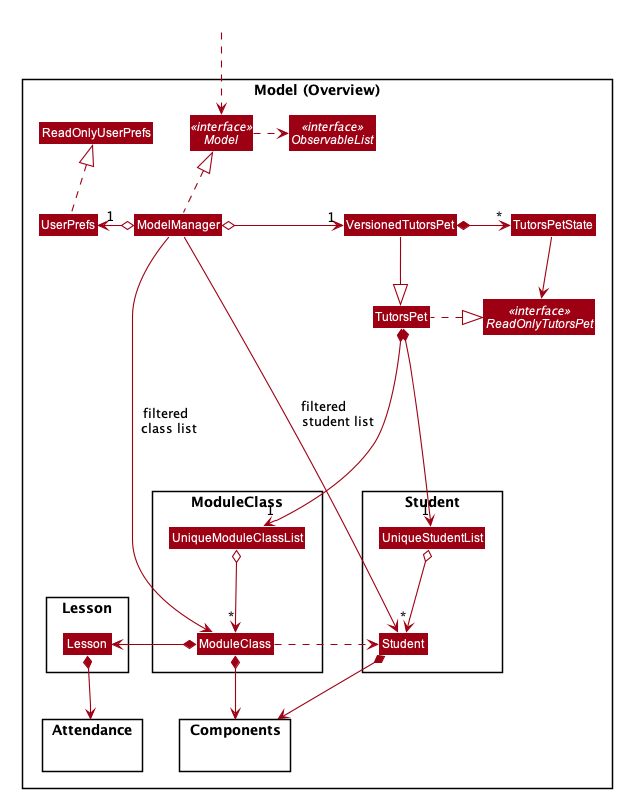

**API** :
[`Model.java`](https://github.com/AY2021S1-CS2103T-T10-4/tp/blob/master/src/main/java/tutorspet/model/Model.java)

The class diagram below shows the design of the `Student` and `ModuleClass` packages.

<a name="structure-of-student-class-model"/>

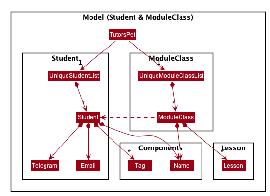

The class diagram below shows the design of the `Lesson` and `Attendance` packages.

<a name="structure-of-lesson-attendance-model"/>

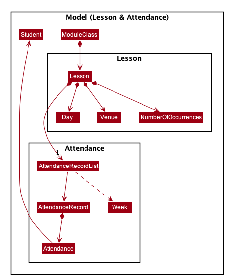

### Storage component

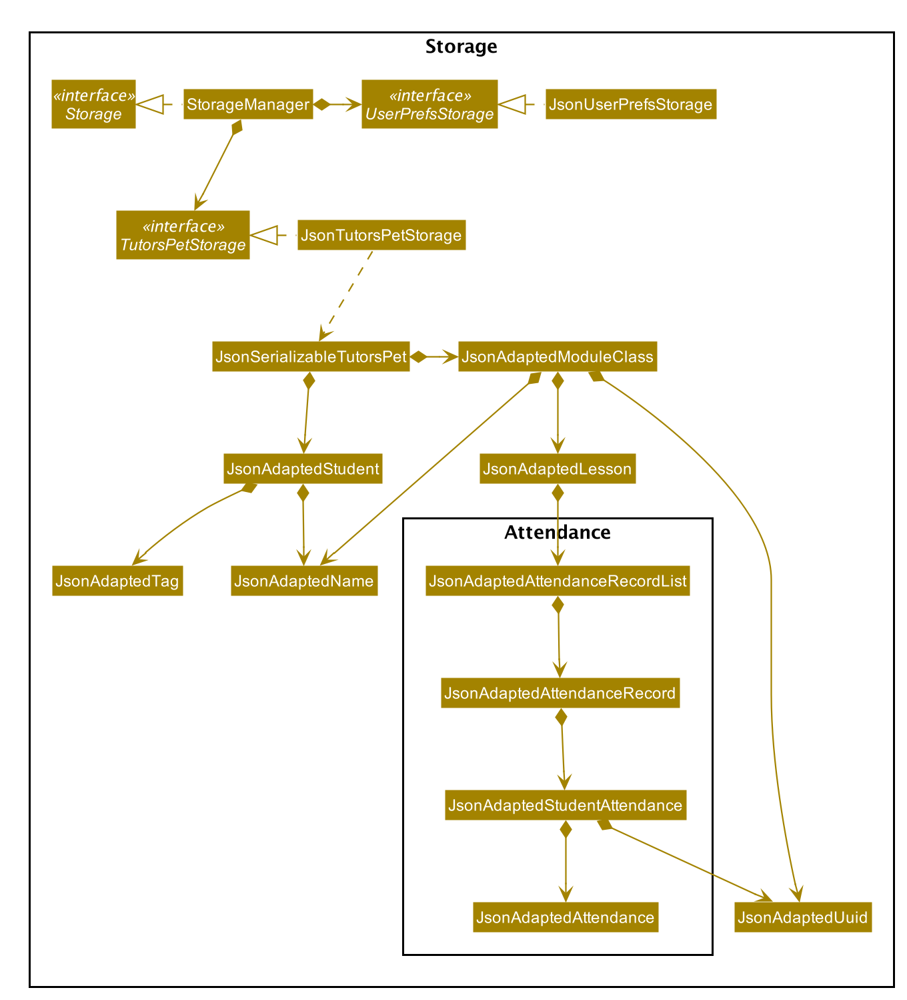

**API** : [`Storage.java`](https://github.com/se-edu/addressbook-level3/tree/master/src/main/java/seedu/address/storage/Storage.java)

The `Storage` component,
* can save `UserPref` objects in json format and read it back.
* can save the address book data in json format and read it back.

### Common classes

Classes used by multiple components are in the `seedu.addressbook.commons` package.

--------------------------------------------------------------------------------------------------------------------

## Implementation

This section describes some noteworthy details on how certain features are implemented.

### Student Model and Student Universally Unique Identifier (UUID)

A `UUID` is a unique 128-bit number to identify a unique `Student` within Tutor’s Pet.
In Tutor’s Pet, every `Student` upon construction is assigned a randomly generated `UUID` that is used to
uniquely identify a `Student` across `Classes` and `Lessons`. This is important because we are dealing with
`Student` data not just in the `Student` model itself, but also `Classes` and `Lessons`. Using a
`Student` `UUID` will help to ensure referential integrity of `Student` data across different models when
`Student` data is modified by the user.

#### Implementation

The class diagram below shows the current implementation of `Student` model.

Every `Student` contains a `UUID`, `Name`, `Telegram`, `Email`, and a set of `Tags`.

From the object diagram above, we have designed the `Student` model such that every `Student` like `Alice`
has a unique 128 bit `UUID` tagged to him/her, in addition to the `Name`, `Telegram`, `Email`, and `Tags`
fields providing information of the `Student`.

#### Design Considerations

This section elaborates further on the reason why we eventually chose to adopt a `UUID` over other potential
solutions.

##### Aspect 1: How to uniquely identify Students across models.

* **Alternative 1 (current choice):** Assign a `UUID` tag to each `Student`
  * Pros:
    * Convenient to generate `UUID` in Java as Java has a `UUID` package to support `UUID`s.
    * `UUID` is non-editable.
  * Cons:
    * Implementation is slightly more complicated as caution must be taken in integrating the `UUID` field into
      `Student` model, and enforce `Student` equality checks using `UUID` in Tutor’s Pet.
    * Although the chances are low, it is possible that generating random `UUID`s present a risk of `UUID` collisions
      when we deal with large amounts of student data.

* **Alternative 2:** Enforce that each `Student` must have a unique `Email`
  * Pros:
    * Easier to implement as the original AB3 already has an `Email` field integrated into it.
  * Cons:
    * The `Email` field is editable while the unique identifier of each `Student` should not be editable to prevent
      the need to cascade a change in the identifier of the `Student`.

### ModuleClass Model
This section explains the design considerations of the `ModuleClass` model.

#### Implementation
The class diagram below shows the current implementation of `ModuleClass` model.

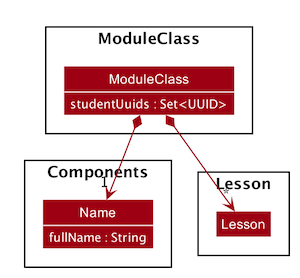

A `ModuleClass` contains a `Name`, and also a set of `studentUuids` that is enrolled in the class.
A `ModuleClass` can also contain any number of `Lesson` objects.

#### Design Considerations

##### Aspect 1: Student storage

* **Alternative 1 (current choice):** Stores `Student` `UUID` object in `ModuleClass` as a Set.
  This implementation ensures that there are no duplicate students found in a class.
  * Pros:
    * Ensures that all students within a class are unique.
  * Cons:
    * There is a possibility of UUID collision, even though the probability is very low.

* **Alternative 2:** Stores `Student` object in `ModuleClass`.
   * Pros:
     * Easy to implement.
   * Cons:
     * Difficult to check for duplicate students when adding or editing students in classes.

### Display Statistics Feature

#### Implementation

The display statistics mechanism is facilitated by `StatisticsCommand`. It extends `Command`.

* DisplayStatisticsCommand#execute(): Do validity check and returns a specific student's statistics if all
 validations passed.

The following class diagram shows the relationship between classes during the execution of a `StatisticsCommand`:

The following sequence diagram shows the interactions within the `Logic` component during the execution
of a `StatisticsCommand`:

1. `Logic` uses the `TutorsPetParser` class to parse the user command.
1. A new instance of a `StatisticsCommand` object would be created by the `StatisticsCommandParser` and returns to
   `TutorsPetParser`.
1. `TutorsPetParser` encapsulates the `StatisticsCommand` object as a `Command` object which is executed by
   the `LogicManager`.
1. The command execution calls static methods from the `ModuleClassUtil` and `LessonUtil` classes.
1. As seen above, `ModuleClassUtil` then iterates through the list of lessons to calculate the student's participation
   score and absent weeks by using `LessonUtil#getParticipationScoreFromLesson(lesson, student)` and
   `LessonUtil#getAbsentWeekFromLesson(lesson, student)` respectively.
1. `StatisticsCommand` takes the results from the previous step and processed the values.
1. `StatisticsCommand`encapsulates the result into a `CommandResult` object which is passed back to the `Ui`.

#### Design Considerations

##### Aspect 1: How statistics feature executes

* **Alternative 1 (current choice):** Extract the methods out to another class
(`ModuleClassUtil` and `LessonClassUtil`).
  * Pros:
    * Does not violate the law of demeter. Increases cohesion and thus increase maintainability and testability.
  * Cons:
    * Requires more wrapper methods to carry information.
    * More effort to implement.

* **Alternative 2:** Obtain all attendance information within `StatisticsCommand#execute()`.
  * Pros:
    * Easy, straightforward to implement.
  * Cons:
    * Violates the law of demeter to a large extent.

##### Aspect 2: Responsibility of relevant methods

* **Alternative 1 (current choice):** Allow `ModuleClassUtil#getParticipationScore` and
`ModuleClassUtil#getAbsentWeek` to return intermediate values.
  * Pros:
    * Reduce the responsibilities of `ModuleClassUtil#getParticipationScore` and `ModuleClassUtil#getAbsentWeek`.
  * Cons:
    * Additional processing required to process the results of the method calls in `StatisticsCommand#execute()`.

* **Alternative 2:** Allow `ModuleClassUtil#getParticipationScore` and
`ModuleClassUtil#getAbsentWeek` to return a `String` representation directly.
  * Pros:
    * Easy, straightforward to implement.
    * Do not need to iterate through scores and weeks in `StatisticsCommand`.
  * Cons:
    * `ModuleClassUtil#getParticipationScore` and `ModuleClassUtil#getAbsentWeek` would have too many
       responsibilities. Violates the Single Responsibility Principle.

### Add Attendance Feature

#### Implementation

This feature records the attendance of a specific student for a specific week's lesson.
The add attendance mechanism is facilitated by `AddAttendanceCommand`. It extends `Command`.

* AddAttendanceCommand#execute(): Do validity check and adds a student's attendance for a particular week's lesson if
 all validations passed.

The following sequence diagram shows the interactions between the `Model` and `Logic` components during the execution
 of a `AddAttendanceCommand`:

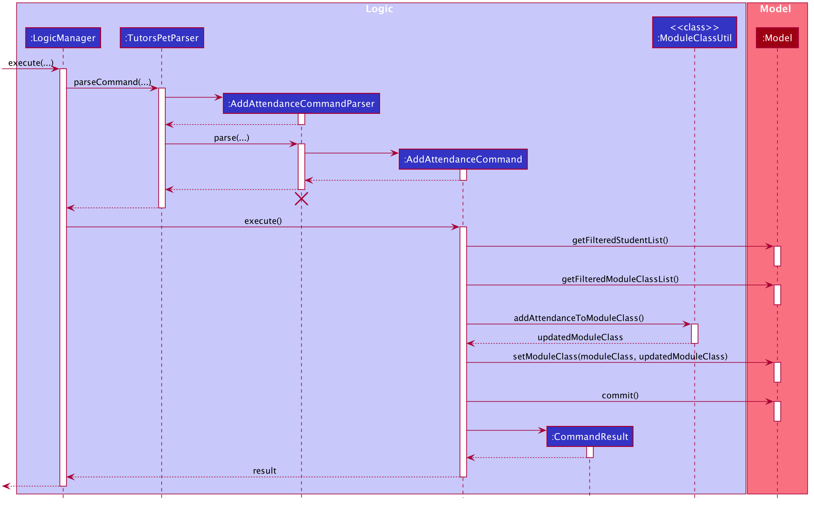

1. `Logic` uses the `TutorsPetParser` class to parse the user command.
1. A new instance of a `AddAttendanceCommand` object would be created by the `AddAttendanceCommandParser` and returns
 to `TutorsPetParser`.
1. `TutorsPetParser` encapsulates the `AddAttendanceCommand` object as a `Command` object which is executed by
 the `LogicManager`.
1. The command execution calls `getFilteredStudentList` and `getFilteredModuleClassList` to get the `targetStudent` and
 `targetModuleClass` respectively using indexes from the user input.
1. As seen from the diagram above, `ModuleClassUtil#addAttendanceToModuleClass()` is then called. Execution of that
 method returns a new `ModuleClass` object with the new attendance of the `targetStudent` added.
1. The `targetModuleClass` in the `model` is then updated with the new `ModuleClass` object.
1. The results of the command execution is committed using `commit()` method for `undo/redo` functionalities.
1. The result of the command execution is encapsulated as a `CommandResult` object which is passed back to the `Ui`.

The following activity diagram shows how the `add attendance` operation works.

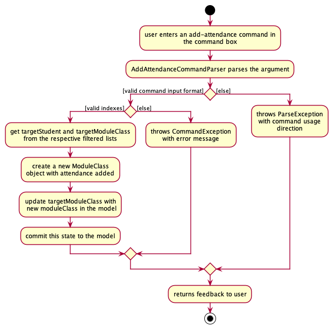

#### Design Considerations

##### Aspect 1: How `add attendance` feature executes

* **Alternative 1 (current choice):** User can only add one attendance at a time.

  * Pros:
    * Less complex code reduces the possibility of bugs.
  * Cons:
    * Less convenient for users as they would have to add attendances for the whole class one at a time.

:information_source: **Note:** Users can make use of the command recall feature to speed up the recording of
 attendances.

* **Alternative 2:** User can add multiple student's attendances for a specific week's lesson at the same time.

  * Pros:
    * Provides greater convenience for users as they can add attendances for the whole class in a single command.
    * Greater flexibility as users can choose whether to key in attendance one at a time or all at once.
  * Cons:
    * More complex code leading to higher possibility of bugs.

**Justification**

Alternative 1 was chosen because the cons of implementing alternative 2 outweighs the benefits derived from it. It is
unlikely for multiple students to have the same participation score and hence the use of this command with multiple
students is expected to be low. In addition, users can make use of the `recall` feature to speed up the process of
recording attendances.

### Lesson Model
This section explains the design considerations of the `Lesson` model.

#### Implementation
The class diagram below shows the current implementation of `Lesson` model.

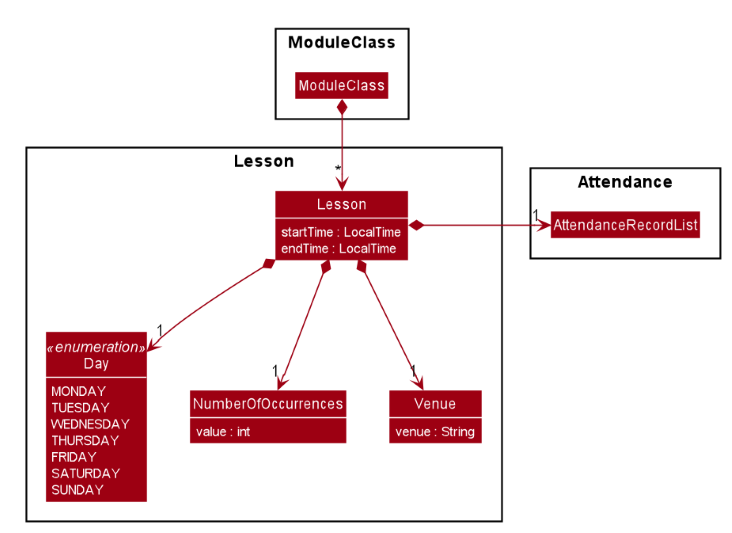

A `ModuleClass` can contain any number of `Lesson` objects. Every `Lesson` contains a `startTime`, `endTime`, `Day`,
`NumberOfOccurrences`, `Venue` and `AttendanceRecordList`.

#### Design Considerations

##### Aspect 1: Lesson storage

* **Alternative 1 (current choice):** Stores `Lesson` object in `ModuleClass`

  This implementation allows duplicate lessons in different classes.
  * Pros:
    * Easy to implement.
  * Cons:
    * Difficult to check for duplicate lessons when adding or editing lessons.

* **Alternative 2:** Have UUID field for `Lesson` and `ModuleClass` stores UUID

  This is similar to how `Student` is implemented. It would be a better alternative if we want all lessons to be unique
  as we can have a `UniqueLessonList` to store all lessons as shown below.

  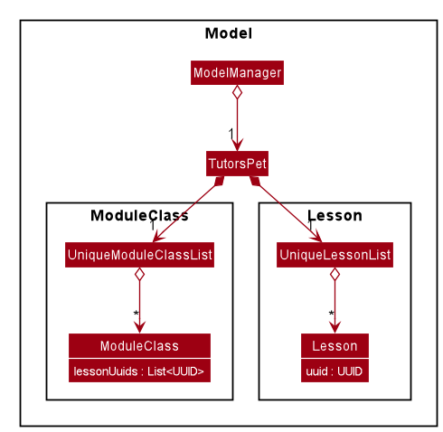

  * Pros:
    * Easy to check for duplicate lessons.
  * Cons:
    * There is a possibility of UUID collision, even though the probability is very low.
    * Harder to implement.

### Attendance Model
This section explains the design considerations of the `Attendance` model.

#### Implementation
The `Attendance`, `AttendanceRecord` and `AttendanceRecordList` models are implemented as follows:

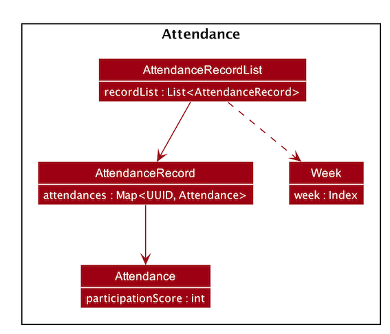

`Attendance` encapsulates the information of a particular student's attendance in a specific lesson he/she has attended.
`AttendanceRecord` refers to the actual attendance roster of a particular lesson event.
It contains the `Attendance`s of all `Student`s who have attended the particular lesson.
These information are stored as a `Map` with `Student` `UUID` as keys.
`AttendanceRecordList` refers to the list of all `AttendanceRecord` instances.
The size of this list is fixed and is determined by the `NumberOfOccurences` in `Lesson`.

:information_source:
**Note:** All classes in the `Attendance` package are designed to be immutable.

#### Design Considerations

##### Aspect 1: Reducing user input
Users should not have to type in attendance-related commands when the student is absent from a lesson.
Therefore, the `Attendance` class does not have, for example, a `boolean hasAttended` attribute.
It only has a `participationScore` attribute.

##### Aspect 2: Maintaining immutability and optimising `AttendanceRecord`
* **Alternative 1 (current choice):** Dynamically updating `AttendanceRecord` whenever there is a change to attendance.
  * Pros:
    * Guarantees immutability.
  * Cons:
    * Requires re-instantiation of a `Map` object whenever a user adds/edits/deletes an `Attendance`.

* **Alternative 2:** Initialising empty `Attendance` instances for all students on call to constructor method. \
This would mean each `Attendance` is set to a particular value, whenever there is a change to an `AttendanceRecord`.
  * Pros:
    * Less overhead in modifying `Attendance`.
  * Cons:
    * Violates immutability.
    * Incurs greater memory use.

Alternative 1 was chosen as we prioritized immutability.
The main benefit of Alternative 2 is that the entire `Map` object need not be copied every time everytime a user adds/edits/deletes an `Attendance`.
However, this would violate immutability of the `Attendance` package.
So, we have decided to implement Alternative 1.

##### Aspect 3: Handling of invalid `Week` number
* **Alternative 1 (current choice):** Store `AttendanceRecord`s in a fixed size `List`.
  * Pros:
    * Handles exceptions easily when a user inputs a week number greater than the total number of lessons.
    * Provides constant time access as the week number is used as an index to the `List`.
    * Easier to iterate over for `StatisticsCommand`.
  * Cons:
    * Requires additional methods to ensure the size of the `List` is fixed.

* **Alternative 2:** Store a `Map` of `Week` number to `AttendanceRecord`.
  * Pros:
    * Incurs less memory use.
  * Cons:
    * More difficult to iterate over for `StatisticsCommand`.
    * More difficult to implement as each `Week` number must be checked to ensure it does not exceed `NumberOfOccurrences` in `Lesson`.

Alternative 1 was chosen as it was easier to check for invalid week numbers.
To check for invalid week numbers in Alternative 2, additional checks have to be done within the `AttendanceRecordList` class to ensure the week numbers do not exceed the `NumberOfOccurrences`.

The sequence diagram below shows how an `Attendance` instance is retrieved.

To avoid implementing add, edit and delete methods in the `Attendance` package, we created utility classes instead to handle these operations.
These utility classes are `ModuleClassUtil`, `LessonUtil` and `AttendanceRecordListUtil`.

### Undo/Redo Feature

The Undo/Redo feature allows users to revert wrongly executed commands.

This section explains the implementation of the Undo and Redo mechanism and highlights the design considerations taken into account when implementing this feature.

#### Implementation

The Undo/Redo mechanism is designed around maintaining a history of `TutorsPet` states, and restoring a particular state when the user triggers an undo or redo command.

The undo and redo mechanism is facilitated by `VersionedTutorsPet`. It extends `TutorsPet` with a history of Tutor's Pet states,
stored internally as a list of `TutorsPetState`. It also maintains a `statePointer` to keep track of the undo/redo history.

A `TutorsPetState` object contains a Tutor's Pet state, represented as a `ReadOnlyTutorsPet`, along with a message that describes the changes relevant to this state.

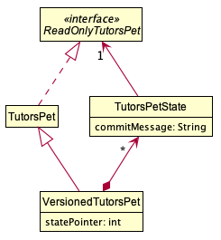

Additionally, it implements the following operations:

* `VersionedTutorsPet#commit(String commitMessage)` – Saves the current Tutor's Pet state, along with the corresponding commit message, in its history.
* `VersionedTutorsPet#undo()` – Restores the previous Tutor's Pet state from its history.
* `VersionedTutorsPet#redo()` – Restores a previously undone Tutor's Pet state from its history.

These operations are exposed in the `Model` interface as `Model#commit(String commitMessage)`, `Model#undo()` and `Model#redo()` respectively.

Given below is an example usage scenario and how the undo/redo mechanism behaves at each step:

1. The user launches the application for the first time. The `VersionedTutorsPet` will be initialized with the initial Tutor's Pet state.
   This initial state will be saved into the `tutorsPetStateList`, and the `statePointer` will point to this initial `TutorsPetState`.

   

2. The user executes `delete-student 5` command to delete the 5th student in Tutor's Pet.
   The `delete-student` command calls `Model#commit(String commitMessage)` after it has deleted the student.
   This causes the modified state of Tutor's Pet, after the `delete-student 5` command has executed, to be saved in the `tutorsPetStateList`.
   The `statePointer` will be updated to point to the newly inserted `TutorsPetState`.

   

3. The user executes `add-student n/David …` to add a new student.
   The `add-student` command also calls `Model#commit(String commitMessage)` after it has added the new student.
   This causes another modified Tutor's Pet state to be saved into the `tutorsPetStateList`.

   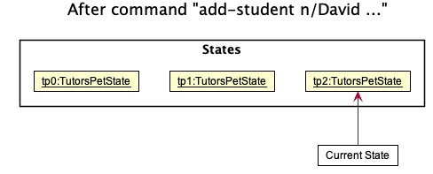

    

    :information_source: **Note:** If a command fails its execution, it will not call `Model#commit(String commitMessage)`.
    This prevents an erroneous duplicate state to be saved into `tutorsPetStateList`.
    

4. The user now decides that adding the student was a mistake, and decides to undo that action by executing the `undo` command.
   The `undo` command will call `Model#undo()`, which shifts the `statePointer` once to the left, pointing it to the previous state, and restores Tutor's Pet to that state.

   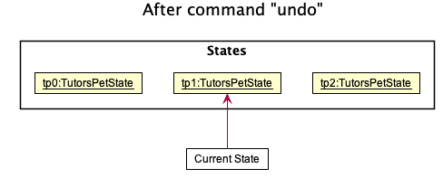

    

    :information_source: **Note:** If the `statePointer` is at index 0, pointing to the initial Tutor's Pet state, then there are no previous Tutor's Pet states to restore.
    The `undo` command uses `Model#canUndo()` to check if this is the case.
    If so, it will return an error to the user rather than attempting to perform the undo.
    

5. The user decides to execute the command `list`.
   Commands that do not modify the contents of Tutor's Pet, such as `list`, do not call `Model#commit(String commitMessage)`,
   `Model#undo()` or `Model#redo()`. Thus, the `tutorsPetStateList` remains unchanged.

   

6. The user then executes `clear`, which calls `Model#commit(String commitMessage)`.
   Since the `statePointer` is not pointing to the last entry of `tutorsPetStateList`, all Tutor's Pet states after the `statePointer` will be purged,
   and the new Tutor's Pet state after the `clear` command has executed will be saved into the `tutorsPetStateList`.

   Future states after the `statePointer` are purged when saving a new state in order to maintain a linear history of revertible commands.
   This is the behavior that most modern desktop applications follow.

   

 

The following sequence diagram shows how the undo operation works:

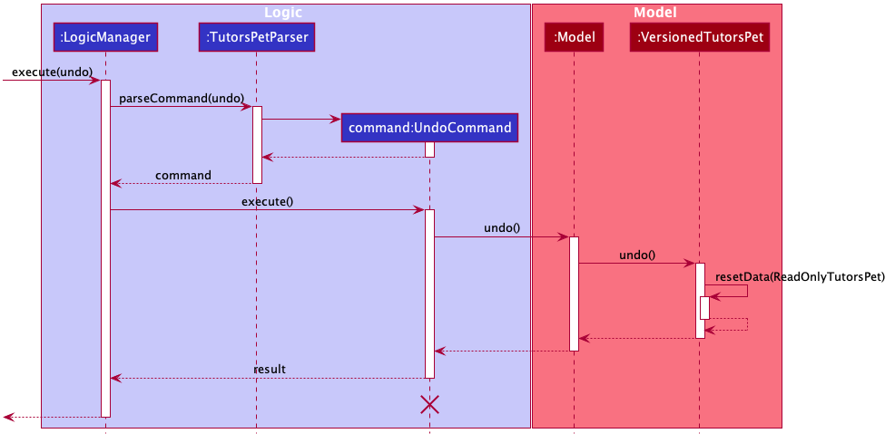

:information_source: **Note:** The lifeline for `UndoCommand` should end at the destroy marker (X) but due to a limitation of PlantUML, the lifeline reaches the end of diagram.

 

The `redo` command does the opposite — it calls `Model#redo()`, which shifts the `statePointer` once to the right, pointing to the previously undone state, and restores Tutor's Pet to that state.

:information_source: **Note:** If the `statePointer` is at index `tutorsPetStateList.size() - 1`, pointing to the latest Tutor's Pet state, then there are no undone Tutor's Pet states to restore.
The `redo` command uses `Model#canRedo()` to check if this is the case.
If so, it will return an error to the user rather than attempting to perform the redo.

 

The following activity diagram summarizes what happens when a user executes a new command:

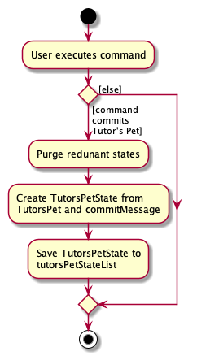

#### Design Considerations

##### Aspect 1: How undo & redo executes

Two possible implementations the undo/redo mechanism were considered.

* **Alternative 1 (current choice):** Save all data stored in Tutor's Pet at a given state.
  * Pros: Easy to implement.
  * Cons: May have performance issues in terms of memory usage.

* **Alternative 2:** Commands are designed such that they can reverse the result of their execution.
  * Pros: Will use less memory (e.g. for `delete-student`, save only the student deleted, so that it can be restored when undo is called).
  * Cons: We must ensure that the implementation of each individual command are correct.

Alternative 1 was chosen due to the limited time that was available for this project. The integrity of data was deemed to be
more important than the performance of the application since the product was designed for single user scenarios and
modern machines should be more than capable of handling the potential performance impact of alternative 1.

In addition, the immutable property of the data within the application made it significantly easier for alternative 1 to be implemented.

##### Aspect 2: Commands to support for undo/redo

A key purpose of the undo/redo feature is to prevent the accidental loss of data due to wrongly executed commands.

As such, it was decided that only commands that alter the data in Tutor's Pet would have their state saved, since commands
that do not alter the data of Tutor's Pet would not have any data that would be irrecoverable from an earlier state.

### Command Recall Feature

The command recall feature reduces the effort required by users when frequently entering similar commands.
It allows users to view and reuse previously edited commands through the <kbd>UP</kbd> and <kbd>DOWN</kbd> arrow keys
when the command box is focused.

This section explains the implementation of the Command Recall feature and highlights the design considerations taken into
account when implementing this feature.

#### Implementation

The command recall mechanism is designed around maintaining a list of previously executed commands, and traversing this list
when the user requests to recall a previous command.

The command recall mechanism is facilitated by `CommandHistory`, which consists of a list of previously executed commands,
stored internally as a list of `String`, and a `pointer` to determine the location of the currently recalled command.
In addition, it also consists of a cache, which is used to store the user's existing input.

:information_source: **Note:** The data stored in `CommandHistory` does not persist when the application is exited.

When the application is started, the `CommandHistory` is initialized with an empty list, and the `pointer` is set to
the size of the list, currently zero. After each successful command has been executed, the user input used to trigger the command
will be appended to the list and the `pointer` will be set to the current size of the list (henceforth known as the **default position**),
after the update regardless of its original position. The cache will also be cleared.

:information_source: **Note:** With this implementation of the default position of the pointer,
if the text contained in the command box is a new user input,
then the `pointer` index is one greater than the last stored command.
This makes it easier to identify when the current text should be cached.

When the user presses the <kbd>UP</kbd> arrow key, a check is performed to determine if there is a next available command to recall.
If there is a previous command available, `CommandHistory` next checks if the `pointer` is currently pointing to an entry in its list.
If the `pointer` is not currently pointing to an entry in the list, i.e. it is in its default position,
the current text in the command box is stored in the cache.

Otherwise, there is no change to the cached value. Subsequently, `CommandHistory` decreases its `pointer` by one,
and the respective `String` in the list is returned. The text in the command box is then set to the returned `String`.

If there are no earlier commands to recall, then there is no change to the text in the command box.

:information_source: **Note:** Any edits made by the user to recalled commands are not stored.

When the user presses the <kbd>DOWN</kbd> arrow key, a check is performed to determine if there is a next available command to recall.
If there is a next available command, the `pointer` index is increased and the respective `String` in the list is returned.

Otherwise, if there is no available next command, i.e. the pointer index is at the last element in the list, then the cached value (if there is one) is returned instead.

 

The activity diagram below provides a summary of the recall command mechanism.

#### Design Considerations

##### Aspect 1: Behaviour when returning from most recent recalled command

Two possible behaviours were considered when designing the recall command feature.

* **Alternative 1 (current choice):** Display any text the user had entered before recalling commands.
  * Pros: The user does not loose any progress to partially typed commands.
  * Cons: Difficult to implement.

* **Alternative 2:** Reset the command box to its blank state.
  * Pros: Easy to implement.
  * Cons: The user looses any partially typed commands.

Alternative 1 was chosen as it followed the behaviour of common tools, such as the unix terminal and Windows Command Prompt,
that our target users were familiar with.

--------------------------------------------------------------------------------------------------------------------

## Documentation, logging, testing, configuration, dev-ops

* [Documentation guide](Documentation.md)
* [Testing guide](Testing.md)
* [Logging guide](Logging.md)
* [Configuration guide](Configuration.md)
* [DevOps guide](DevOps.md)

--------------------------------------------------------------------------------------------------------------------

## Appendix: Requirements

### Product scope

**Target user profile**:

* Has a need to manage students enrolled in classes
* Prefer desktop apps over other types
* Can type fast
* Prefers typing to mouse interactions
* Is reasonably comfortable using CLI apps

**Value proposition**: Manage students and classes faster than a typical mouse/GUI driven app

### User stories (Completed)

Priorities: High (must have) - `* * *`, Medium (nice to have) - `* *`, Low (unlikely to have) - `*`

| Priority | As a …                   | I want to...                                        | So that I can...                                               |   Status  |
|----------|--------------------------|-----------------------------------------------------|----------------------------------------------------------------|:---------:|
| * * *    | Tutor with many students | Store my students' contact info/emails              | Contact them easily                                            | COMPLETED |
| * * *    | Tutor with many classes  | Insert my students into the appropriate classes     | Organise my students via classes                               | COMPLETED |
| * * *    | Tutor                    | Delete student entries                              | Update my list of students if a student were to drop the class | COMPLETED |
| * * *    | Tutor with many classes  | Create classes                                      | Put my students in the appropriate classes                     | COMPLETED |
| * * *    | New Tutor                | View the help menu                                  | Be familiar with app usage                                     | COMPLETED |
| * *      | Tutor with many students | Keep notes on each student's performance            | Track their progress over time                                 | COMPLETED |
| * *      | Tutor                    | Mark my student's attendance and participation      | Gauge each student's participation level                       | COMPLETED |
| * *      | Tutor                    | Update the information of my students               | Update my understanding of the progress of my students         | COMPLETED |
| * *      | Tutor                    | Categorise my students into how well they are doing | Dedicate more time towards the weaker students                 | COMPLETED |
| * *      | Tutor                    | View all my lessons                                 | Manage my time more efficiently                                | COMPLETED |
| * *      | Tutor                    | Set recurring events (eg. lessons for every week)   | Avoid typing the same events                                   | COMPLETED |
| * *      | Busy Tutor               | Store zoom links                                    | Retrieve these zoom links for my lessons, consultations, etc.  | COMPLETED |
| * *      | Busy Tutor               | Store class rooms                                   | Be reminded of my lesson venues                                | COMPLETED |
| * *      | Careless tutor           | Undo my commands                                    | Correct any errors when I input things wrongly                 | COMPLETED |
| * *      | Careless Tutor           | Redo my undone actions                              | Easily reverse my accidental undos.                            | COMPLETED |
| *        | Caring tutor             | Take note of student's special needs, if any        | Cater my teaching toward them                                  | COMPLETED |

### User stories (Not Implemented)

Priorities: High (must have) - `* * *`, Medium (nice to have) - `* *`, Low (unlikely to have) - `*`

| Priority | As a …                                                       | I want to...                                                      | So that I can...                                                                |      Status     |
|----------|--------------------------------------------------------------|-------------------------------------------------------------------|---------------------------------------------------------------------------------|:---------------:|
| * *      | Tutor                                                        | View my students' test scores easily                              | Gauge my teaching efficiency                                                    | NOT IMPLEMENTED |
| * *      | Tutor teaching CS modules                                    | View my students' GitHub                                          | Gauge my student's progress in their coding assignment                          | NOT IMPLEMENTED |
| * *      | Tutor                                                        | Record my feedback for my students                                | Give participation points                                                       | NOT IMPLEMENTED |
| * *      | Tutor                                                        | Calculate the mean, median, mode of my students' scores           | Gauge the overall performance of my class                                       | NOT IMPLEMENTED |
| * *      | Tutor                                                        | Store the questions asked by students                             | Provide students with answers immediately, for questions that were asked before | NOT IMPLEMENTED |
| * *      | Tutor                                                        | Be reminded of my lessons                                         | Attend them                                                                     | NOT IMPLEMENTED |
| * *      | Forgetful Tutor                                              | Track all my tasks                                                | Know which is of greater urgency                                                | NOT IMPLEMENTED |
| *        | Tutor                                                        | Store teaching feedback given by my students                      | Improve my teaching                                                             | NOT IMPLEMENTED |
| *        | Tutor teaching modules that require many written assignments | View my student's written submissions                             | Mark/review their homework                                                      | NOT IMPLEMENTED |
| *        | Forgetful Tutor                                              | Store picture of my students                                      | Easily match their faces to their names                                         | NOT IMPLEMENTED |
| *        | Tutor                                                        | Prioritise my tasks                                               | Work on important tasks first                                                   | NOT IMPLEMENTED |
| *        | Forgetful Tutor                                              | Set an alert for task deadlines                                   | Complete my tasks on time                                                       | NOT IMPLEMENTED |
| *        | Tutor                                                        | Find free time                                                    | Provide consultation for students                                               | NOT IMPLEMENTED |
| *        | Tutor                                                        | Store teaching feedback given by Professors                       | Improve my teaching                                                             | NOT IMPLEMENTED |
| *        | Tutor                                                        | Manage my teaching materials                                      | Find them easily                                                                | NOT IMPLEMENTED |
| *        | Tutor                                                        | Keep track of the hours I have spent teaching/preparing for class | Be aware of how much time I have spent on teaching                              | NOT IMPLEMENTED |
| *        | Tutor for many semesters                                     | Archive my past semesters                                         | Avoid cluttering the app                                                        | NOT IMPLEMENTED |

### Use cases

| Use Case ID | Description                               |
|-------------|-------------------------------------------|
| UC01        | Add a student                             |
| UC02        | List students                             |
| UC03        | Edit a student                            |
| UC04        | Find a student                            |
| UC05        | Delete a student                          |
| UC06        | Clear all students                        |
| UC07        | Add a class                               |
| UC08        | List classes                              |
| UC09        | List students within a class              |
| UC10        | Edit a class                              |
| UC11        | Find a class                              |
| UC12        | Delete a class                            |
| UC13        | Clear all classes                         |
| UC14        | List students and classes                 |
| UC15        | Link a student to a class                 |
| UC16        | Unlink a student from a class             |
| UC17        | Add a lesson                              |
| UC18        | Edit a lesson                             |
| UC19        | Delete a lesson                           |
| UC20        | Add an attendance record of a student     |
| UC21        | Edit the attendance record of a student   |
| UC22        | Find the attendance record of a student   |
| UC23        | Delete the attendance record of a student |

(For all use cases below, the **System** is `Tutor's Pet` and the **Actor** is the `user`, unless specified otherwise)

**Use case: UC01 - Add a student**

**MSS**

1.  User requests to add a student.
2.  User provides the parameters to be added.
3.  Tutor's Pet adds the student.

    Use case ends.

**Extensions**

* 2a. The parameters provided are invalid.

    * 2a1. Tutor's Pet shows an error message.

      Use case ends.

**Use case: UC02 - List students**

**MSS**

1.  User requests to list students.
2.  Tutor's Pet shows a list of students.

    Use case ends.

**Use case: UC03 - Edit a student**

**MSS**

1.  User requests to list students.
2.  Tutor's Pet shows a list of students.
3.  User requests to edit a specific student in the list.
4.  User provides the parameters that are to be edited.
5.  Tutor's Pet edits the student's information.

    Use case ends.

**Extensions**

* 2a. The list is empty.

  Use case ends.

* 3a. The given index is invalid.

    * 3a1. Tutor's Pet shows an error message.

      Use case resumes at step 2.

* 4a. The parameters provided are invalid.

    * 4a1. Tutor's Pet shows an error message.

      Use case resumes at step 2.

**Use case: UC04 - Find a student**

**MSS**

1.  User requests to find a student.
2.  User provides the parameters to find student.
3.  Tutor's Pet finds the student.
4.  Tutor's Pet displays all matching students found.

    Use case ends.

**Extensions**

* 3a. No students found.

    * 3a1. Tutor's Pet displays a message that no students are found.

      Use case ends.

**Use case: UC05 - Delete a student**

**MSS**

1.  User requests to list students.
2.  Tutor's Pet shows a list of students.
3.  User requests to delete a specific student in the list.
4.  Tutor's Pet removes the student from its associated class.
5.  Tutor's Pet deletes the student.

    Use case ends.

**Extensions**

* 2a. The list is empty.

  Use case ends.

* 3a. The given index is invalid.

    * 3a1. Tutor's Pet shows an error message.

      Use case resumes at step 2.

* 4a. The student is not in a class.

  Use case skips to step 5.

**Use case: UC06 - Clear all students**

**MSS**

1. User requests to clear all students.
2. Tutor's Pet clears all students.

    Use case ends.

**Use case: UC07 - Add a class**

**MSS**

1. User requests to add a class.
2. User provides the parameters of the class.
3. Tutor's Pet adds the class.

    Use case ends.

**Extensions**

* 2a. The parameters provided are invalid.

    * 2a1. Tutor's Pet shows an error message.

      Use case resumes at step 1.

* 3a. The class already exists.

    * 3a1. Tutor's Pet shows an error message.

      Use case resumes at step 1.

**Use case: UC08 - List classes**

**MSS**

1.  User requests to list classes.
2.  Tutor's Pet shows a list of classes.

    Use case ends.

**Use case: UC09 - List students within a class**

**MSS**

1.  User requests to list students within a class.
2.  User specifies the class.
3.  Tutor's Pet shows a list of students in the class.

    Use case ends.

**Extensions**

* 2a. The given class index is invalid.

    * 2a1. Tutor's Pet shows an error message.

      Use case resumes at step 1.

**Use case: UC10 - Edit a class**

**MSS**

1.  User requests to list classes.
2.  Tutor's Pet shows a list of classes.
3.  User requests to edit a specific class in the list.
4.  User provides the parameters that are to be edited.
5.  Tutor's Pet edits the class's information.

    Use case ends.

**Extensions**

* 2a. The list is empty.

  Use case ends.

* 3a. The given index is invalid.

    * 3a1. Tutor's Pet shows an error message.

      Use case resumes at step 2.

* 4a. The parameters provided are invalid.

    * 4a1. Tutor's Pet shows an error message.

      Use case resumes at step 2.

**Use case: UC11 - Find a class**

**MSS**

1.  User requests to find a class.
2.  User provides the parameters to find class.
3.  Tutor's Pet finds the class.
4.  Tutor's Pet displays all matching classes found.

    Use case ends.

**Extensions**

* 3a. No classes found.

    * 3a1. Tutor's Pet displays a message that no classes are found.

      Use case ends.

**Use case: UC12 - Delete a class**

**MSS**

1.  User requests to list classes.
2.  Tutor's Pet shows a list of classes.
3.  User requests to delete a specific class in the list.
4.  Tutor's Pet deletes the class.

    Use case ends.

**Extensions**

* 2a. The list is empty.

  Use case ends.

* 3a. The given index is invalid.

    * 3a1. Tutor's Pet shows an error message.

      Use case resumes at step 2.

**Use case: UC13 - Clear all classes**

**MSS**

1. User requests to clear all classes.
2. Tutor's Pet clears all classes.

    Use case ends.

**Use case: UC14 - List students and classes**

**MSS**

1.  User requests to list students and classes.
2.  Tutor's Pet shows a list of students and a list of classes.

    Use case ends.

**Use case: UC15 - Link a student to a class**

**MSS**

1.  User requests to list classes.
2.  Tutor's Pet shows a list of classes.
3.  User requests to list students.
4.  Tutor's Pet shows a list of students.
5.  User requests to link a specific student to a specific class in the list.
6.  Tutor's Pet links the specified student to the specified class.

    Use case ends.

**Extensions**

* 2a. The list is empty.

  Use case ends.

* 4a. The list is empty.

  Use case ends.

* 5a. At least one of the given indexes is invalid.

    * 5a1. Tutor's Pet shows an error message.

      Use case resumes at step 4.

**Use case: UC16 - Unlink a student from a class**

**MSS**

1.  User requests to list classes.
2.  Tutor's Pet shows a list of classes.
3.  User requests to list students.
4.  Tutor's Pet shows a list of students.
5.  User requests to unlink a specific student from a specific class in the list.
6.  Tutor's Pet unlinks the specified student from the specified class.

    Use case ends.

**Extensions**

* 2a. The list is empty.

  Use case ends.

* 4a. The list is empty.

  Use case ends.

* 5a. At least one of the given indexes is invalid.

    * 5a1. Tutor's Pet shows an error message.

      Use case resumes at step 4.

* 5b. The specified student is not linked to the specified class.

    * 5b1. Tutor's Pet shows an error message.

      Use case ends.

**Use case: UC17 - Add a lesson**

**MSS**

1. User requests to add a lesson.
2. User provides the parameters of the lesson.
3. Tutor's Pet adds the lesson.

    Use case ends.

**Extensions**

* 2a. The parameters provided are invalid.

    * 2a1. Tutor's Pet shows an error message.

      Use case resumes at step 1.

* 3a. The lesson already exists.

    * 3a1. Tutor's Pet shows an error message.

      Use case resumes at step 1.

**Use case: UC18 - Edit a lesson**

**MSS**

1.  User requests to edit a specific lesson.
2.  User provides the parameters that are to be edited.
3.  Tutor's Pet edits the lesson's information.

    Use case ends.

**Extensions**

* 1a. One or more of the given indexes are invalid.

    * 1a1. Tutor's Pet shows an error message.

      Use case resumes at step 1.

* 2a. The parameters provided are invalid.

    * 2a1. Tutor's Pet shows an error message.

      Use case resumes at step 1.

**Use case: UC19 - Delete a lesson**

**MSS**

1.  User requests to delete a specific lesson.
2.  Tutor's Pet deletes the lesson.

    Use case ends.

**Extensions**

* 1a. One or more of the given indexes are invalid.

    * 1a1. Tutor's Pet shows an error message.

      Use case resumes at step 1.

**Use case: UC20 - Add an attendance record of a student**

**MSS**

1. User requests to add an attendance record of a student.
2. User provides the parameters of the attendance record.
3. Tutor's Pet adds the attendance record.

    Use case ends.

**Extensions**

* 2a. The parameters provided are invalid.

    * 2a1. Tutor's Pet shows an error message.

      Use case resumes at step 1.

* 3a. The attendance record already exists.

    * 3a1. Tutor's Pet shows an error message.

      Use case resumes at step 1.

**Use case: UC21 - Edit the attendance record of a student**

**MSS**

1.  User requests to edit a specific attendance record.
2.  User provides the parameters that are to be edited.
3.  Tutor's Pet edits the attendance record's information.

    Use case ends.

**Extensions**

* 1a. One or more of the given indexes are invalid.

    * 1a1. Tutor's Pet shows an error message.

      Use case resumes at step 1.

* 2a. The parameters provided are invalid.

    * 2a1. Tutor's Pet shows an error message.

      Use case resumes at step 1.

**Use case: UC22 - Find the attendance record of a student**

**MSS**

1.  User requests to find an attendance record.
2.  User provides the parameters to find attendance record.
3.  Tutor's Pet finds the attendance record.
4.  Tutor's Pet displays matching attendance record found.

    Use case ends.

**Extensions**

* 3a. No attendance records found.

    * 3a1. Tutor's Pet displays a message that no attendance records are found.

      Use case ends.

**Use case: UC23 - Delete the attendance record of a student**

**MSS**

1.  User requests to delete a specific attendance record.
2.  Tutor's Pet deletes the attendance record.

    Use case ends.

**Extensions**

* 1a. One or more of the given indexes are invalid.

    * 1a1. Tutor's Pet shows an error message.

      Use case resumes at step 1.

### Non-Functional Requirements

1.  Should work on any _mainstream OS_ as long as it has Java `11` or above installed.
2.  Should be able to hold up to 1000 students and classes without a noticeable sluggishness in performance for typical usage.
3.  A user with above average typing speed for regular English text (i.e. not code, not system admin commands) should be able to accomplish most of the tasks faster using commands than using the mouse.

*{More to be added}*

### Glossary

* **Mainstream OS**: Windows, Linux, Unix, OS-X

--------------------------------------------------------------------------------------------------------------------

## Appendix: Instructions for manual testing

Given below are instructions to test the app manually.

:information_source: **Note:** These instructions only provide a starting point for testers to work on;
testers are expected to do more *exploratory* testing.

### Launch and shutdown

1. Initial launch

   1. Download the jar file and copy into an empty folder

   1. Double-click the jar file Expected: Shows the GUI with a set of sample contacts. The window size may not be optimum.

1. Saving window preferences

   1. Resize the window to an optimum size. Move the window to a different location. Close the window.

   1. Re-launch the app by double-clicking the jar file. 
       Expected: The most recent window size and location is retained.

1. _{ more test cases …​ }_

### Deleting a person

1. Deleting a person while all persons are being shown

   1. Prerequisites: List all persons using the `list` command. Multiple persons in the list.

   1. Test case: `delete 1` 
      Expected: First contact is deleted from the list. Details of the deleted contact shown in the status message. Timestamp in the status bar is updated.

   1. Test case: `delete 0` 
      Expected: No person is deleted. Error details shown in the status message. Status bar remains the same.

   1. Other incorrect delete commands to try: `delete`, `delete x`, `...` (where x is larger than the list size) 
      Expected: Similar to previous.

1. _{ more test cases …​ }_

### Saving data

1. Dealing with missing/corrupted data files

   1. _{explain how to simulate a missing/corrupted file, and the expected behavior}_

1. _{ more test cases …​ }_
