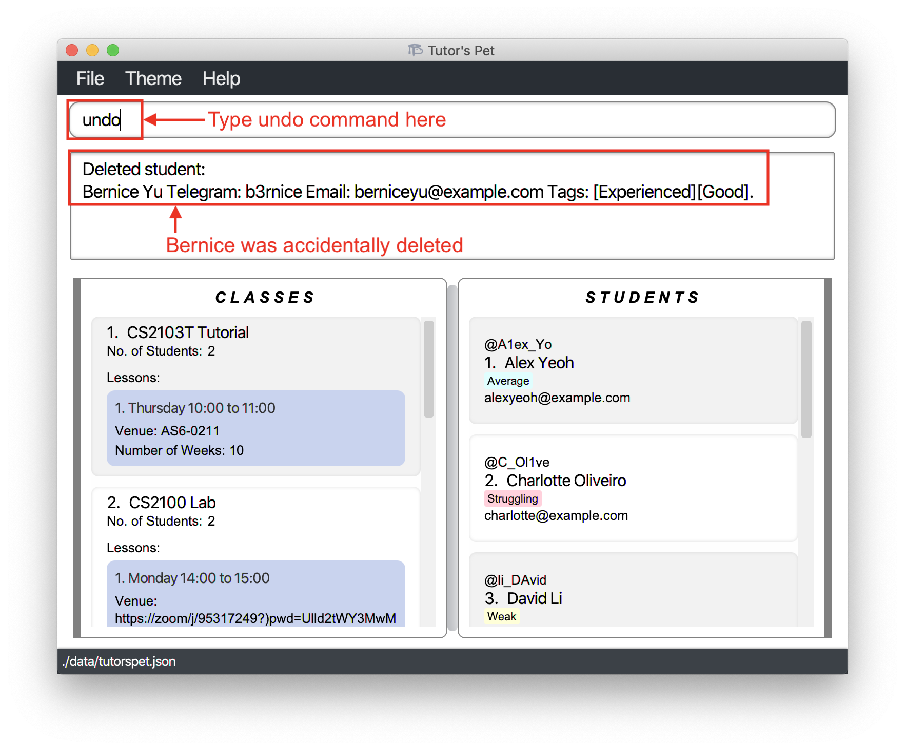
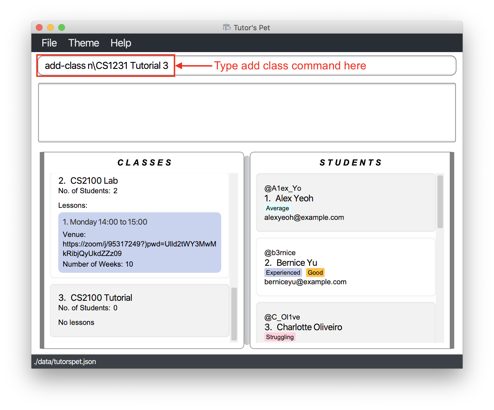
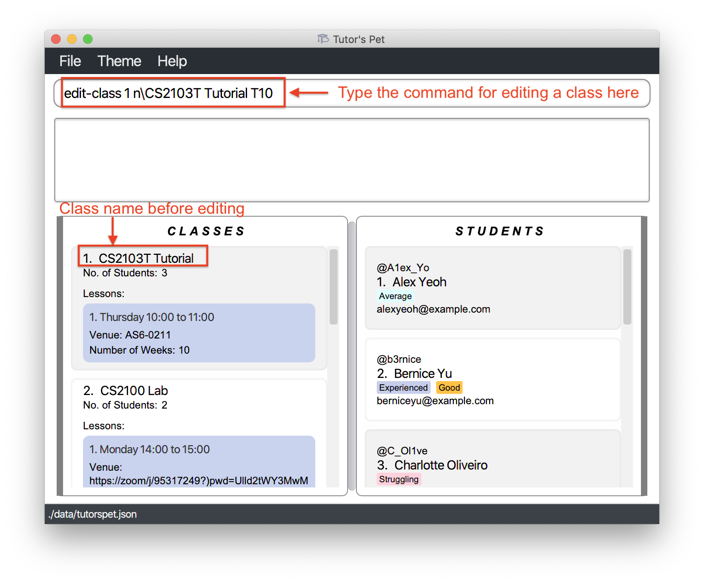
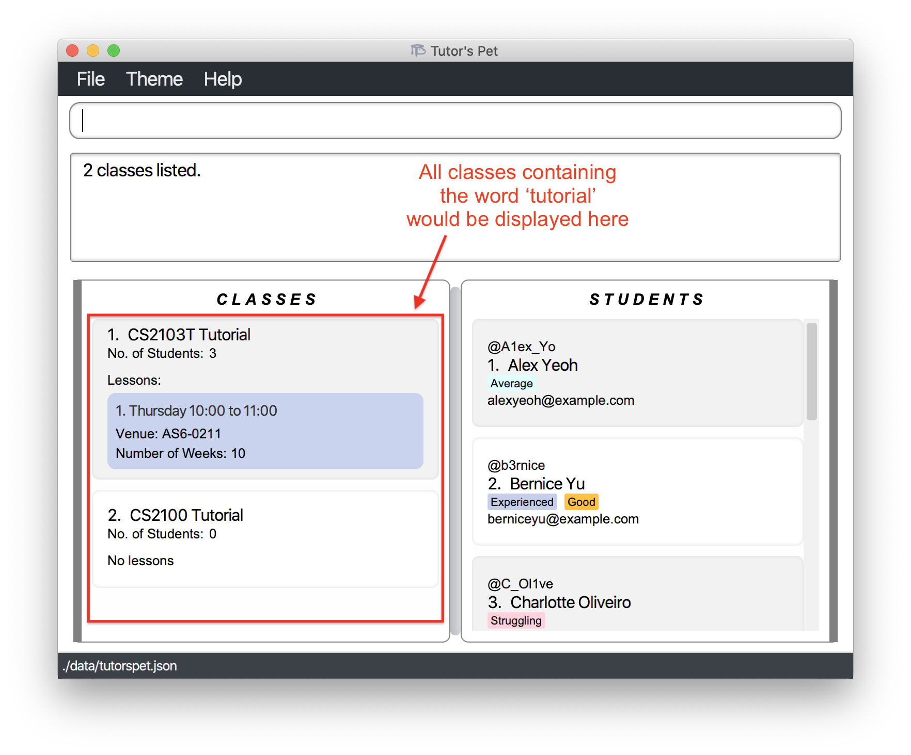
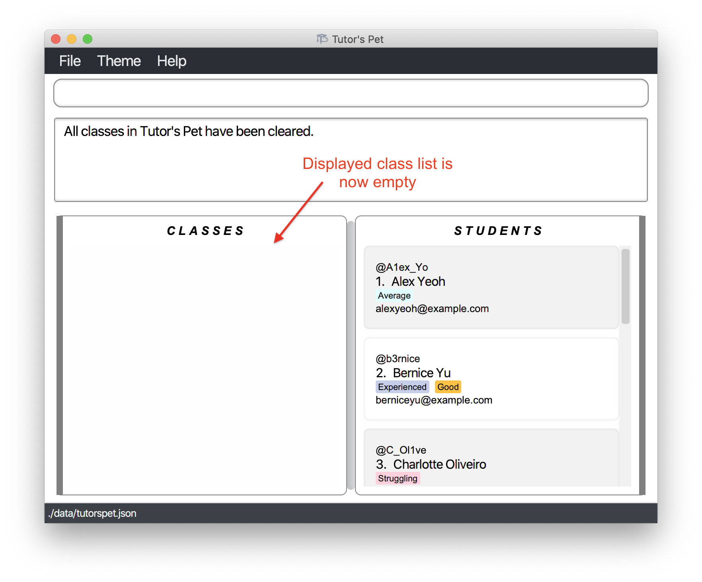
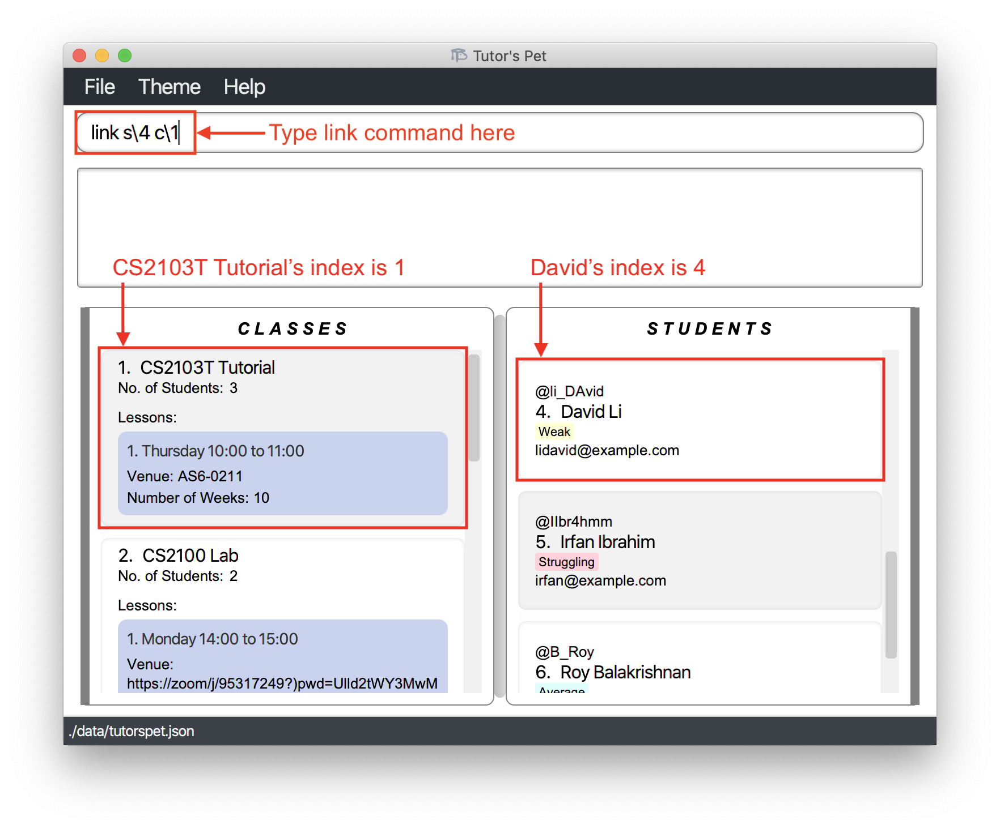
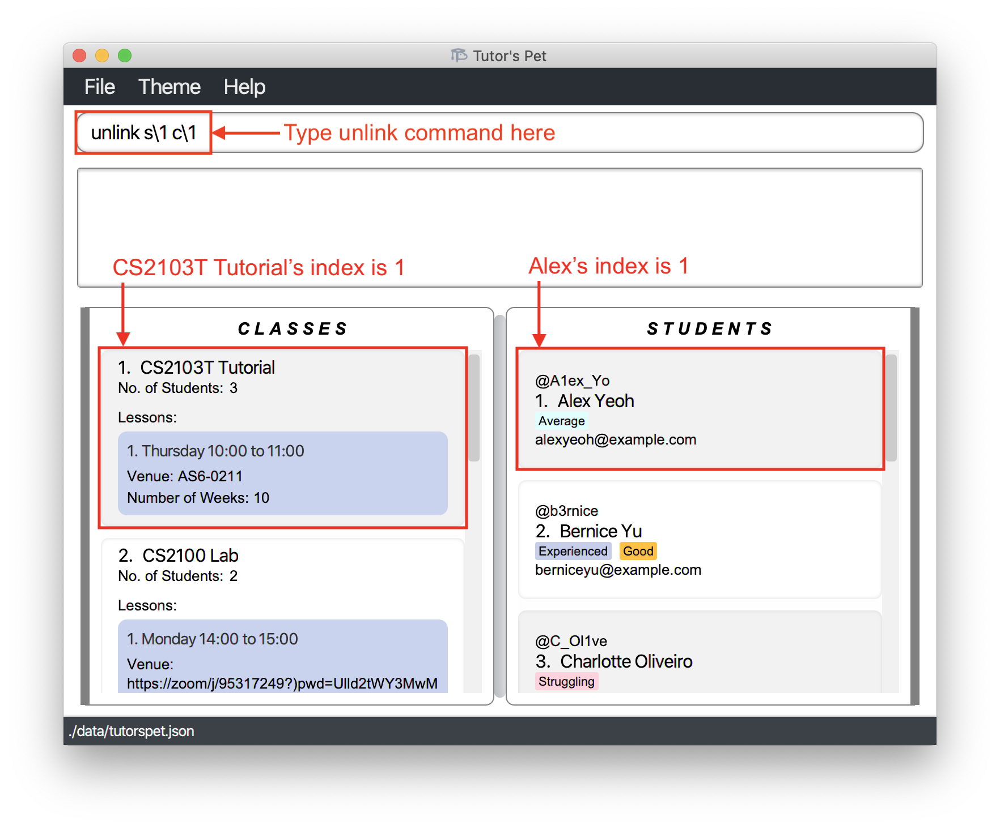
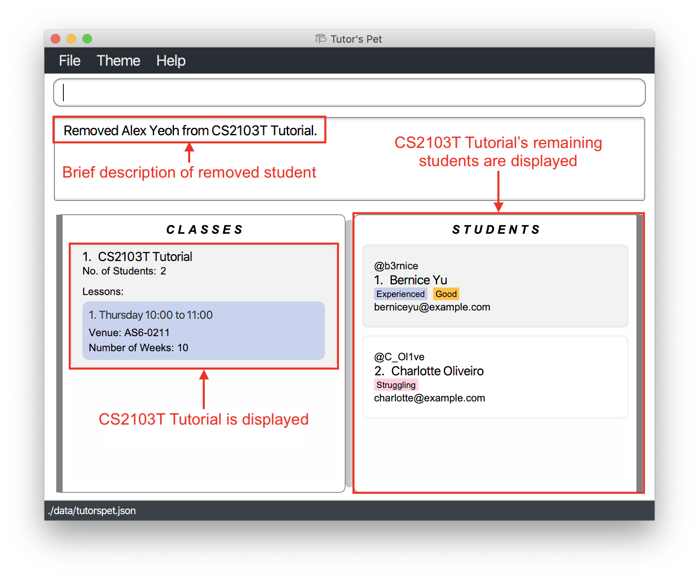
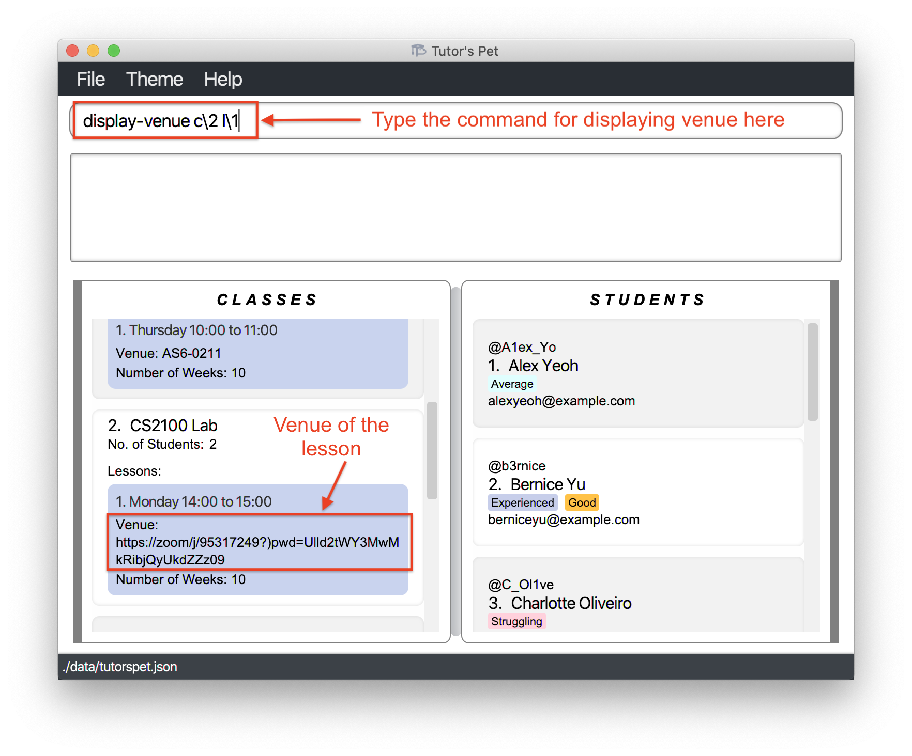
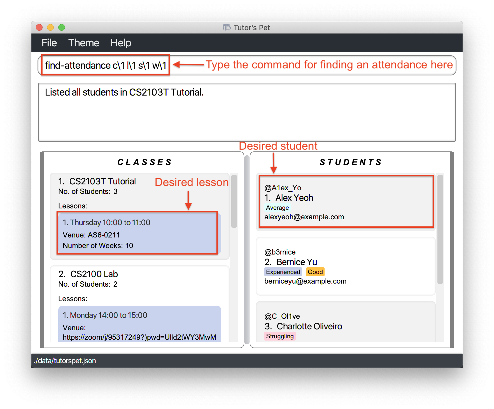

* Table of Contents
{:toc}

## Introduction

Tutor's Pet is a **student management application** for teaching assistants in NUS Computing.
Tutor's Pet reduces the amount of time you spend on administrative tasks as a teaching assistant.
It is a one stop solution to keep track of your classes, students, and their progress.

As a teaching assistant, administrative chores such as attendance taking and grading students' participation
can be troublesome with existing solutions such as spreadsheets. This is why we have created _Tutor's Pet, a
solution for teaching assistants, by students._

## About

This user guide provides documentation on the installation and usage of Tutor's Pet.
It also provides a comprehensive description of features available to you and
includes a [quick-start](#quick-start) section that helps you get started.

### Using This Guide

The following features are used in this guide to make it easier for you to navigate around:

* You can click on [blue words](#using-this-guide) to jump to the related section.
* `Words with a grey background` refer to keywords used as part of commands or responses from your Tutor's Pet.
* Words in <kbd>block font</kbd> refer to keyboard keys that you can press.

--------------------------------------------------------------------------------------------------------------------

## Quick Start
### Installing Tutor's Pet

Here are a few steps to get you started on Tutor's Pet:

1. Ensure you have Java **11** or above installed in your Computer.

2. Download the latest **tutorspet.jar** [here](https://github.com/AY2021S1-CS2103T-T10-4/tp/releases).

3. Copy the file to the folder you want to use as the home folder for your Tutor's Pet.

4. Double-click the file to start the application. The GUI similar to the below should appear in a few seconds. 

   
   Figure 1. GUI for Tutor's Pet.

### Using Tutor's Pet

This section offers an overview of Tutor's Pet layout.

There are three main areas in Tutor's Pet:

1. A command box and result display box.

2. A main viewing area.

3. A utility area.

The command box is the area for you to enter your commands. The result of each command would be shown in the result
display box, which is located immediately below the command box.

   
    Figure 2. The command box and result display box.

* Type a command in the command box and press <kbd>Enter</kbd> to execute it. 
   e.g. typing **`help`** and pressing <kbd>Enter</kbd> will open the help window. 

   Some example commands you can try:

   * **`list`** : Lists all students and classes.

   * **`add-student`**`n\John Doe t\johndoe e\johnd@example.com tag\student` : Adds a student named `John Doe`
   to the application.

   * **`delete-student`**`3` : Deletes the 3rd student shown in the current list.

   * **`clear-student`** : Deletes all students.

   * **`exit`** : Exits the app.

* Refer to the [Features](#features) below for details of each command.

The main viewing area consists of two sections: **Classes** and **Students**.

* The **Classes** section contains information about classes and lessons in Tutor's Pet. To view the list of all
 classes in Tutor's Pet, make use of the **`list-class`** command.

    
     Figure 3. The class section.

* The **Students** section displays contains information about students in Tutor's Pet. To view the list of all
 students in Tutor's Pet, make use of the **`list-student`** command.

    
     Figure 4. The student section.

The utility area consists of three tabs: **File**, **Theme**, **Help**.

* The **File** tab consists of an exit button. To exit Tutor's Pet, click on the exit button. Alternatively, make
 use of the `exit` command to exit the application.

* The **Theme** tab consist of 3 different themes, mainly **Light**, **Alternate** and **Dark**. To change the theme of
 your Tutor's Pet, click on one of these buttons.

* The **Help** tab consists of a help button. If you require any assistance, click on the help button, copy the link
 given and paste it into any web browsers. Alternatively, press <kbd>F1</kbd> to bring up the help window.

   
    Figure 5. The Theme tab.

--------------------------------------------------------------------------------------------------------------------

## Features

**:information_source: Notes about the command format:** 

* Words in `UPPER_CASE` are the parameters to be supplied by the user. 
  e.g. in `add-student n/NAME`, `NAME` is a parameter which can be used as `add-student n/John Doe`.

* Items in square brackets are optional. 
  e.g `n/NAME [tag/TAG]` can be used as `n/John Doe tag/student` or as `n/John Doe`.

* Items with `…​` after them can be used multiple times including zero times. 
  e.g. `[tag/TAG]…​` can be used as ` ` (i.e. 0 times), `tag/student`, `tag/average tag/TA candidate` etc.

* Parameters can be in any order. 
  e.g. if the command specifies `n/NAME t/TELEGRAM_USERNAME`, `t/TELEGRAM_USERNAME n/NAME` is also acceptable.

## Command Overview

| Action                            | Format, Examples                                                                                                                                                          |
|-----------------------------------|---------------------------------------------------------------------------------------------------------------------------------------------------------------------------|
| **Help**                          | `help`                                                                                                                                                                    |
| **Undo**                          | `undo`                                                                                                                                                                    |
| **Redo**                          | `redo`                                                                                                                                                                    |
| **View Change History**           | `view-history`                                                                                                                                                            |
| **Exit**                          | `exit`                                                                                                                                                                    |
| **Reset**                         | `reset`                                                                                                                                                                   |
| **Add Student**                   | `add-student n\NAME t\TELEGRAM_USERNAME e\EMAIL [tag\TAG]…​`   e.g., `add-student n\John Doe t\johndoe e\johnd@example.com tag\student`                             |
| **List All Students**             | `list-student`                                                                                                                                                            |
| **Edit Student**                  | `edit-student INDEX [n\NAME] [t\TELEGRAM_USERNAME] [e\EMAIL] [tag\TAG]…​`  e.g., `edit-student 2 n\James Lee e\jameslee@example.com`                                |
| **Find Student**                  | `find-student KEYWORD [MORE_KEYWORDS]`  e.g., `find-student James Jake`                                                                                                |
| **Delete Student**                | `delete-student INDEX`  e.g., `delete-student 3`                                                                                                                       |
| **Clear All Students**            | `clear-student`                                                                                                                                                           |
| **Add Class**                     | `add-class n\CLASS_NAME`  e.g., `add-class n\CS2103T Tutorial T10`                                                                                                     |
| **List All Classes**              | `list-class`                                                                                                                                                              |
| **List Students In A Class**      | `list-students c\INDEX`  e.g., `list-students c\3`                                                                                                                     |
| **Edit Class**                    | `edit-class INDEX n\CLASS_NAME`   e.g., `edit-class 1 n\CS2103T Tutorial T10`                                                                                          |
| **Find Class**                    | `find-class KEYWORD [MORE_KEYWORDS]`  e.g., `find-class CS2103T`                                                                                                       |
| **Delete Class**                  | `delete-class INDEX`   e.g., `delete-class 2`                                                                                                                          |
| **Clear All Classes**             | `clear-class`                                                                                                                                                             |
| **List All Students And Classes** | `list`                                                                                                                                                                    |
| **Linking Student To A Class**    | `link s\STUDENT_INDEX c\CLASS_INDEX`  e.g., `link s\1 c\2`                                                                                                             |
| **Unlink Student From A Class**   | `unlink s\STUDENT_INDEX c\CLASS_INDEX`   e.g., `unlink s\1 c\2`                                                                                                        |
| **Add Lesson**                    | `add-lesson c\CLASS_INDEX d\DAY st\START_TIME et\END_TIME v\VENUE r\NO_OF_TIMES`   e.g., `add-lesson c\1 d\MONDAY st\0800 et\1000 v\COM1 #01-01 r\13`                  |
| **Edit Lesson**                   | `edit-lesson c\CLASS_INDEX l\LESSON_INDEX [d\DAY] [st\START_TIME] [et\END_TIME] [v\VENUE]`   e.g., `edit-lesson c\1 l\1 d\TUESDAY st\1000 et\1200 v\COM2 #02-02`       |
| **Delete Lesson**                 | `delete-lesson c\CLASS_INDEX l\LESSON_INDEX`   e.g., `delete-lesson c\1 l\1`                                                                                           |
| **Display Venue**                 | `display-venue c\CLASS_INDEX l\LESSON_INDEX`  e.g., `display-venue c\1 l\1`
| **Add Attendance Record**         | `add-attendance c\CLASS_INDEX l\LESSON_INDEX s\STUDENT_INDEX w\WEEK p\PARTICIPATION_SCORE`   e.g., `add-attendance c\1 l\1 s\1 w\1 p\1`                                |
| **Edit Attendance Record**        | `edit-attendance c\CLASS_INDEX l\LESSON_INDEX s\STUDENT_INDEX w\WEEK p\PARTICIPATION_SCORE`   e.g., `edit-attendance c\1 l\1 s\1 w\1 p\10`                             |
| **Find Attendance Record**        | `find-attendance c\CLASS_INDEX l\LESSON_INDEX s\STUDENT_INDEX w\WEEK`   e.g., `find-attendance c\1 l\1 s\1 w\1`                                                        |
| **Delete Attendance Record**      | `delete-attendance c\CLASS_INDEX l\LESSON_INDEX s\STUDENT_INDEX w\WEEK`   e.g., `delete-attendance c\1 l\1 s\1 w\1`                                                    |
| **Display Statistics**            | `stats c\CLASS_INDEX s\STUDENT_INDEX`  e.g., `stats c\1 s\1`

### General

### Viewing help : `help`

Shows a message explaining how to access the help page.

Format: `help`

#### Undoing previous commands : `undo`

If you have accidentally entered a command that permanently changes the data in your Tutor's Pet,
you can use this command to undo the changes.

Format: `undo`

For example:
* You want to delete Alex from your Tutor's Pet, however you accidentally deleted Bernice instead of Alex.
  You type in the command `undo` and press <kbd>Enter</kbd>.

* Bernice has been undeleted and now you can delete Alex.

#### Redoing previously undone commands : `redo`

If you decide that you did not need to undo a command, instead of typing out the command again, you can use
this command to redo the changes.

Format : `redo`

#### View change history : `view-history`

You can use this command to see a list of changes that can be undone and redone.

Format : `view-history`

#### Exiting the program : `exit`

Exits the program.

Format: `exit`

#### Resetting the program : `reset`

Resets the program and clears all the data.

Format: `reset`

#### Saving the data

Tutor's Pet automatically saves your data to your home folder after any changes are made.
There is no need for you to save manually.

### Managing Students

#### Adding a student : `add-student`

Adds a student to the list of students.

Format: `add-student n/NAME t/TELEGRAM_USERNAME e/EMAIL [tag/TAG]…​`

:bulb: **Tip:**
A student can have any number of tags (including 0)

Examples:
* `add-student n/John Doe t/johndoe e/johnd@example.com`
* `add-student n/Betsy Crowe t/betsycrowe e/betsycrowe@example.com tag/student`

#### Listing all students : `list-student`

Shows a list of all students in the application.

Format: `list-student`

#### Editing a student : `edit-student`

Edits an existing student in the application.

Format: `edit-student INDEX [n/NAME] [t/TELEGRAM_USERNAME] [e/EMAIL] [tag/TAG]…​`

* Edits the student at the specified `INDEX`. The index refers to the index number shown in the displayed student list. The index **must be a positive whole number** 1, 2, 3, …​
* At least one of the optional fields must be provided.
* Existing values will be updated to the input values.
* When editing tags, the existing tags of the student will be removed i.e adding of tags is not cumulative.
* You can remove all the student’s tags by typing `tag/` without
    specifying any tags after it.

Examples:
*  `edit-student 1 t/johndoe e/johndoe@example.com` Edits the telegram username and email address of the 1st student to be `johndoe` and `johndoe@example.com` respectively.
*  `edit-student 2 n/Betsy Crower tag/` Edits the name of the 2nd student to be `Betsy Crower` and clears all existing tags.

#### Finding student by name : `find-student`

Finds students whose names contain any of the given keywords.

Format: `find-student KEYWORD [MORE_KEYWORDS]`

* The search is case-insensitive. e.g `hans` will match `Hans`
* The order of the keywords does not matter. e.g. `Hans Bo` will match `Bo Hans`
* Only the name is searched.
* Only full words will be matched e.g. `Han` will not match `Hans`
* Students matching at least one keyword will be returned (i.e. **OR** search).
  e.g. `Hans Bo` will return `Hans Gruber`, `Bo Yang`

Examples:
* `find-student John` returns `john` and `John Doe`
* `find-student alex david` returns `Alex Yeoh`, `David Li` 

#### Deleting a student : `delete-student`

Deletes the specified student from the application.

Format: `delete-student INDEX`
* Deletes the student at the specified `INDEX`.
* The index refers to the index number shown in the displayed student list.
* The index **must be a positive whole number** 1, 2, 3, …​

Examples:
* `list` followed by `delete-student 2` deletes the 2nd student in the application.
* `find-student Betsy` followed by `delete-student 1` deletes the 1st student in the results of the `find-student` command.

#### Clearing all students : `clear-student`

Clears all students from the application.

Format: `clear-student`

### Managing Classes

#### Adding a class : `add-class`

If you would like to add a new class, you can make use of this command.

Format: `add-class n\CLASS_NAME`
* Adds a class with the specified `CLASS_NAME`.

For example:
* You have just been allocated to teach a tutorial class, Tutorial 3, in the module CS1231.
Hence, you decide to add this new tutorial class to your Tutor's Pet.
You type `add-class n\CS1231 Tutorial 3` and press <kbd>Enter</kbd>.

* The class has been added, and you can see it in the displayed class list.

Constraints:
* The class name can only contain alphabets, numbers and spaces.
* The class name cannot be the same as an existing class in your Tutor's Pet.

#### Listing all classes : `list-class`

Shows a list of all classes in the application.

Format: `list-class`

#### Listing all students within a class : `list-students`

Shows a list of all students within a particular class in the application.

Format: `list-students c/INDEX`
* The index refers to the index number shown in the displayed class list.

Examples:
* `list-students c/3`

#### Editing a class : `edit-class`

If you entered the wrong class name or would like to change the name of a class, you can make use of this command.

Format: `edit-class INDEX n\CLASS_NAME`
* Edits the class at the specified `INDEX`.

For example:
* Your module coordinator decides to allocate another class to you and you want to be able to distinguish between
 the two classes. Hence you decide to edit the `CS2103T Tutorial` class to `CS2103T Tutorial T10`. You type the
 command `edit-class 1 n\CS2103T Tutorial T10` and press <kbd>Enter</kbd>.

    

* The class has been renamed from `CS2103T Tutorial` to `CS2103T Tutorial 10`.

    

Constraints:
* The index refers to the index number shown in the displayed class list.
* The index **must be a positive whole number** 1, 2, 3, …​
* A new class name must be provided.

Other examples:
* `find-class CS2030 lab` 
  `edit-class 1 n\CS2030 lab L05` 
  Edits the name of the 1st class in the results of the find command.

#### Finding class by name : `find-class`

If you would like to find classes that contain any of the given keywords in their name, make use of this command.

Format: `find-class KEYWORD [MORE_KEYWORDS]`

For example:
* You would like to find out how many `Tutorial` classes you are currently teaching. You type the command
 `find-class Tutorial` and press <kbd>Enter</kbd>.

    

* You find out that you are only teaching 2 tutorials this semester and hence decide to accept more classes.

    

Constraints:
* The search is case-insensitive. e.g `cs2103t` will match `CS2103T`
* The order of the keywords does not matter. e.g. `lab CS2100` will match `CS2100 lab`
* Only the name is searched.
* Only full words will be matched e.g. `CS` will not match `CS2100`
* Students matching at least one keyword will be returned (i.e. **OR** search).
  e.g. `CS2103T lab` will return `CS2103T tut`, `CS2100 lab`

Other examples:
* `find-class CS2100` 
    Returns `CS2100 tut` and `CS2100 lab`
* `find-class tut CS2030` 
    Returns `CS2103T tut`, `CS2030 lab`

#### Deleting a class : `delete-class`

If you would like to delete a class, you can make use of this command.

Format: `delete-class INDEX`
* Deletes the class at the specified `INDEX`.
* The index refers to the index number shown in the displayed class list.
* The index **must be a positive whole number** 1, 2, 3, …​

For example:
* You have just received news that one of your classes, CS2100 Lab, has been permanently removed due to low enrollment.
Hence, you want to delete the class from your Tutor's Pet.
You type the command `delete-class 2` and press <kbd>Enter</kbd>.

* The class has been successfully deleted.

Other examples:
* `find-class CS2030 lab` 
  `delete-class 1` 
  Deletes the 1st class in the results of the find class command.

#### Clearing all classes : `clear-class`

If you would like to delete all the classes in Tutor's Pet, make use of this command.

Format: `clear-class`

For example:
* It is the start of a new semester. You would like to delete all information of all the classes you taught last
 semester to start anew. You type the command `clear-class` and press <kbd>Enter</kbd>.

    

* All classes have been cleared. You can start managing your new classes.

    

#### Listing all students and classes : `list`

Shows a list of all students and classes in the application.

Format: `list`

#### Linking a student to a class : `link`

You can link a student to a class using this command.

Format: `link s\STUDENT_INDEX c\CLASS_INDEX`
* Links the student at the specified `STUDENT_INDEX` to the class at the specified `CLASS_INDEX`.

For example:
* You have a new student, David Li, who has transferred into one of your classes, CS2103T Tutorial.
  You have already [added](#adding-a-student--add-student) this student to your Tutor's Pet, and want
  to link him to the class. Hence, you type in the command `link s\4 c\1` and press <kbd>Enter</kbd>.

* Your Tutor's Pet displays the students in CS2103T Tutorial to confirm that you have successfully linked
  David to the class.

Constraints:
* The indexes **must be positive whole numbers** 1, 2, 3, …​

Other examples:
* `find-student Alex`
  `link s\1 c\2`
  Links the 1st result of the find student command to the 2nd class in the displayed class list.

#### Unlinking a student from a class : `unlink`

You can remove a student from a class using this command.

Format: `unlink s\STUDENT_INDEX c\CLASS_INDEX`
* Unlinks the student at the specified `STUDENT_INDEX` from the class at the specified `CLASS_INDEX`.

For example:
* One of your students, Alex Yeoh, has transferred out of your class and you decide to unlink him from his class.
  You type in the command `unlink s\1 c\1` and press <kbd>Enter</kbd>.

* Your Tutor's Pet displays the remaining students in CS2103T Tutorial to confirm that you have successfully unlinked
  Alex from the class.

* Note that all of Alex's attendance in the class was also deleted.

Constraints:
* The indexes **must be positive whole numbers** 1, 2, 3, …​

Other examples:
* `list-student c\2`
  `unlink s\1 c\1`
  Lists the students of the 2nd class in the displayed class list, and unlinks the 2nd student of that class.

### Managing Lessons

#### Adding a lesson : `add-lesson`

Adds a lesson to the application.

Format: `add-lesson c/CLASS_INDEX d/DAY st/START_TIME et/END_TIME v/VENUE r/NO_OF_TIMES`

Examples:
* `add-lesson c/1 d/MONDAY st/0800 et/1000 v/COM1 #01-01 r/13`

#### Editing a lesson : `edit-lesson`

Edits an existing lesson in the application.

Format: `edit-lesson c/CLASS_INDEX l/LESSON_INDEX [d/DAY] [st/START_TIME] [et/END_TIME] [v/VENUE]`

* Edits the lesson at the specified `CLASS_INDEX` + `LESSON_INDEX`.
* The indexes **must be positive whole numbers** 1, 2, 3, …​
* User has to specify at least 1 field (DAY/START_TIME/END_TIME/VENUE) to be changed.

Examples:
*  `edit-lesson c/1 l/1 d/TUESDAY st/1000 et/1200 v/COM2 #02-02` Edits the 1st lesson of the 1st class to be held on Tuesdays, 10.00AM to 12.00PM at COM2 #02-02.

#### Deleting a lesson : `delete-lesson`

If you would like to delete a lesson in a class, you can make use of this command.

Format: `delete-lesson c\CLASS_INDEX l\LESSON_INDEX`
* Deletes the lesson at the specified `CLASS_INDEX` + `LESSON_INDEX`.

For example:
* You receive news that the `Tuesday 10:00-11:00` `CS2103T Tutorial` would be cancelled permanently. You decide to
 remove that lesson from your Tutor's Pet and hence you type in the command `delete-lesson c\1 l\2` and press
 <kbd>Enter</kbd>.

    

* You have one less lesson to teach now.

    

Constraints:
* The indexes **must be positive whole numbers** 1, 2, 3, …​

Other examples:
* `find-class CS2030 lab` 
  `delete-lesson c\1 l\1` 
  Deletes the 1st lesson of the 1st class in the results of the find class command.

#### Display venue : `display-venue`

Gives you the venue of a lesson.

Format: `display-venue c\1 l\1`
* Gives the venue of the lesson specified at `CLASS_INDEX` + `LESSON_INDEX`.

For example:
* Due to covid, most of your physical lessons have been converted to zoom lessons and thus all the venues are
 in the form of zoom links. Your lesson is starting in 10 minutes and it is time to start the session. Hence, you
 input the command `display-venue c\1 l\2` and press <kbd>Enter</kbd>.

    

* You can now proceed to copy the link to that zoom session from the command result box.

    

Constraints:
* The indexes **must be positive whole numbers** 1, 2, 3, …​

### Managing Attendance Records

#### Adding an attendance record : `add-attendance`

If you would like to record a new attendance for a student, you can make use of this command.

Format: `add-attendance c\CLASS_INDEX l\LESSON_INDEX s\STUDENT_INDEX w\WEEK p\PARTICIPATION_SCORE`

For example:
* Your `CS2103T Tutorial` lesson in week 10 has just ended and you would like to give participation scores to the
 students. You decide to start with Alex. Hence, you type in the command `add-attendance c\1 l\1 s\1 w\10 p\80` and
 press <kbd>Enter</kbd>.

    

* You have successfully recorded Alex's attendance. You have another 2 more students' attendance to record.

    

Other Examples:
* `find-class CS2100 lab` 
  `find-student bernice yu` 
  `add-attendance c\1 l\1 s\1 w\10 p\70` 
  Adds the attendance of the 1st student to the 1st lesson of the 1st class in the results of the find commands. 
  Attendance recorded is for week 10 and student's participation score is 70.

* `list-student c\1` 
  `add-attendance c\1 l\1 s\2 w\5 p\50` 
  Adds the attendance of the 2nd student in the results of the list command to the 1st lesson of the 1st class. 
  Attendance recorded is for week 5 and student's participation score is 50.

#### Editing an attendance record : `edit-attendance`

Edits an existing attendance record in the application.

Format: `edit-attendance c/CLASS_INDEX l/LESSON_INDEX s/STUDENT_INDEX w/WEEK p/PARTICIPATION_SCORE`

* Edits the participation score of the attendance record at the specified `CLASS_INDEX` + `LESSON_INDEX` + `STUDENT_INDEX` + `WEEK`.
* The indexes **must be positive whole numbers** 1, 2, 3, …​
* The `WEEK` must be a positive whole number** 1, 2, 3, …​
* The `PARTICIPATION_SCORE` **must be a non-negative whole number** 0, 1, 2, …​

Examples:
*  `edit-attendance c/1 l/1 s/1 w/1 p/10` Edits the 1st week's participation score of the 1st student of the 1st lesson of the 1st class to 10 points.

#### Finding attendance record by indexes: `find-attendance`

If you need to find out a specific student's attendance for a specific week, make use of this command.

Format: `find-attendance c\CLASS_INDEX l\LESSON_INDEX s\STUDENT_INDEX w\WEEK`
* Finds the attendance record at the specified `CLASS_INDEX` + `LESSON_INDEX` + `STUDENT_INDEX` + `WEEK`.

For example:
* It is the end of a semester and it's time to key in your students' attendance into luminus. You would like to find
 out if Alex attended week 1 lesson and hence you type in the command `find-attendance c\1 l\1 s\1 w\1` and press
 <kbd>Enter</kbd>.

    

* Now you can find out if Alex attended the first lesson and how participative he was in week 1.

    

Constraints:
* The indexes **must be positive whole numbers** 1, 2, 3, …​
* The `WEEK` **must be a positive whole number** 1, 2, 3, …​

Other Examples:
* `find-class CS2100 lab` 
  `find-student bernice yu` 
  `find-attendance c\1 l\1 s\1 w\10` 
  Shows the attendance of the 1st student in the 1st lesson of the first class in the results of the find command. 
  Attendance shown is for week 10.

* `list-student c\1`
  `find-attendance c\1 l\1 s\2 w\5`
  Shows the attendance of the 2nd student in the 1st lesson of the first class in the results of the list command.
  Attendance shown is for week 5.

#### Deleting an attendance record : `delete-attendance`

Deletes the specified attendance record from the application.

Format: `delete-attendance c/CLASS_INDEX l/LESSON_INDEX s/STUDENT_INDEX w/WEEK`

* Deletes the attendance record at the specified `CLASS_INDEX` + `LESSON_INDEX` + `STUDENT_INDEX` + `WEEK`.
* The indexes **must be positive whole numbers** 1, 2, 3, …​
* The `WEEK` **must be a positive whole number** 1, 2, 3, …​

Examples:
* `delete-attendance c/1 l/1 s/1 w/1` Deletes the 1st week's attendance record of the 1st student of the 1st lesson of the 1st class.

#### Display Statistics : `stats`

Gives you an overall summary of a student's attendance and participation scores.

Format: `stats c\1 s\1`
* Gives a summary of the student's attendance at the specified `CLASS_INDEX` + `LESSON_INDEX` + `STUDENT_INDEX
` + `WEEK`.

For example:
* It is the end of the semester and time for you to grade a student's class participation. You would like to find out
 if Alex has been participative throughout the semester and hence you type in the command `stats c\1 s\1` and press
 <kbd>Enter<\kbd>.

* Now you can see his average participation score and overall attendance to give a corresponding grade.

Constraints:
* The indexes **must be positive whole numbers** 1, 2, 3, …​

--------------------------------------------------------------------------------------------------------------------

## FAQ

**Q**: How do I transfer my data to another Computer? 
**A**: Install the app in the other computer and overwrite the empty data file it creates with the file that contains the data of your previous Tutor's Pet home folder.

--------------------------------------------------------------------------------------------------------------------

## Glossary

* The `STUDENT_INDEX` refers to the index number shown in the displayed student list.
* The `CLASS_INDEX` refers to the index number shown in the displayed class list.
* The `LESSON_INDEX` refers to the index number of a lesson shown in its class.

--------------------------------------------------------------------------------------------------------------------
